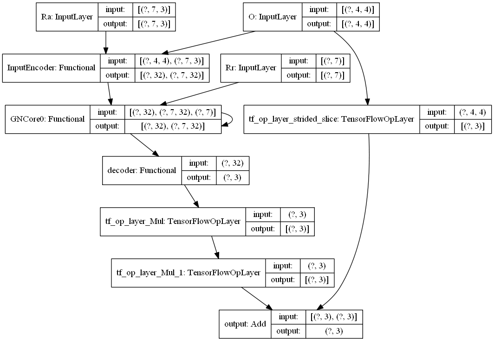
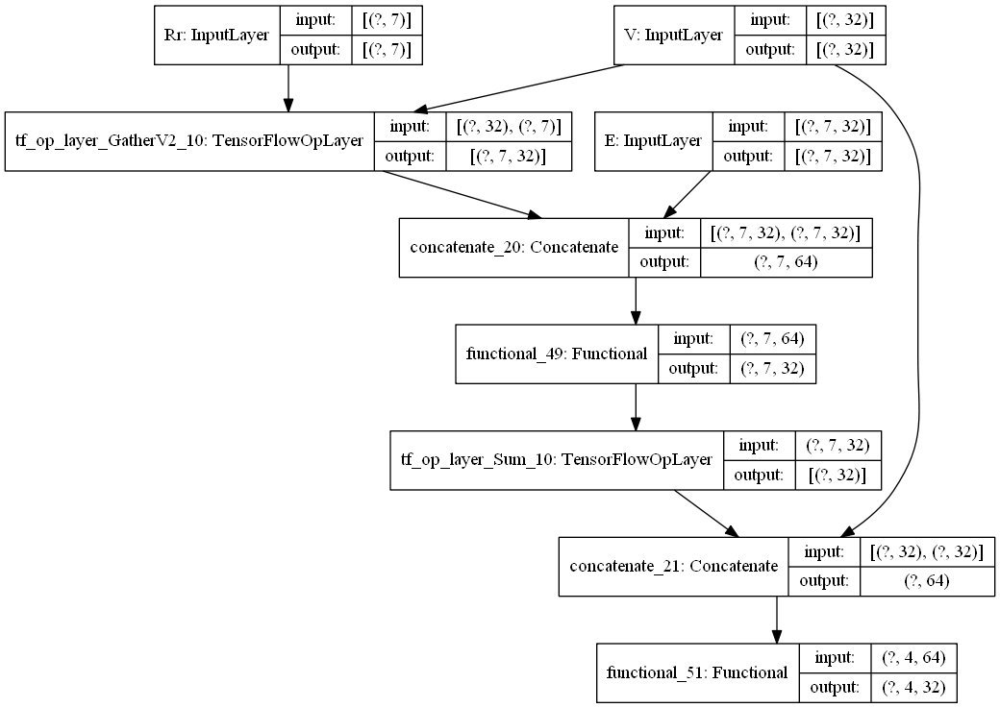

# fluent-net
a graph neural net emulating the eulerian model in fluid dynamics 

inspired by the following works:

- [Interaction Networks for Learning about Objects, Relations and Physics](https://arxiv.org/abs/1612.00222)

- [Neural Message Passing for Quantum Chemistry](https://arxiv.org/abs/1704.01212)

This model adopts an Eulerian approach, calculating parameters based on a mesh, insetad of tracking individual particles

model structure:

overall:

GNCore:

